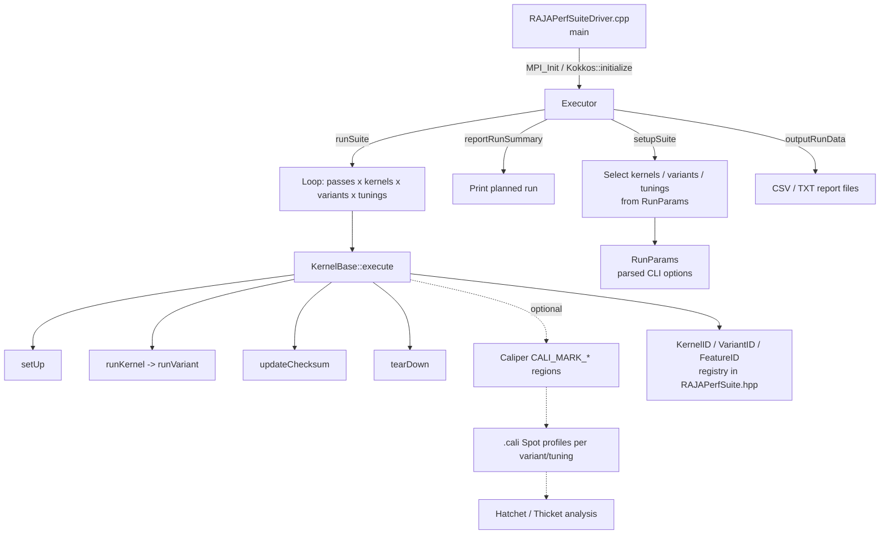
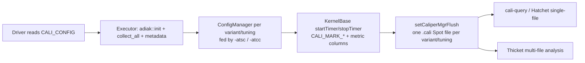

# RAJA Performance Suite (RAJAPerf) — Technical Deep Dive

> Research report on **`LLNL/RAJAPerf`** — a companion benchmark suite to the RAJA
> performance-portability library. Investigated at commit
> `5e095c190bcb9ebfb0469ba320a30dc9f6f15568` (default branch `develop`, version 2025.12.1).

---

## Executive Summary

The **RAJA Performance Suite** (`LLNL/RAJAPerf`, "RAJAPerf") is LLNL's benchmark suite for measuring the runtime performance of loop-based HPC computational kernels implemented with the [RAJA](https://github.com/LLNL/RAJA) C++ portability abstractions, compared head-to-head against equivalent implementations written directly in native parallel programming models (OpenMP, CUDA, HIP, SYCL, OpenMP-target, Kokkos).[^readme] Each kernel is expressed once and run in multiple **variants** — `Base_*` (native raw code), `Lambda_*` (native loop invoking a C++ lambda), and `RAJA_*` (RAJA abstraction) — so the overhead (or benefit) of the RAJA layer can be isolated.[^variantenum][^daxpyseq]

Architecturally, the suite is a thin `main()` driver that delegates to a single `Executor`, which drives a fleet of kernel objects that all derive from the `KernelBase` lifecycle class.[^driver][^kernelbasevirtuals] Kernels are grouped (`basic`, `lcals`, `polybench`, `stream`, `apps`, `algorithm`, `comm`) and each is split across a header of shared body macros plus one `.cpp` per backend.[^groups][^daxpyhpp] The suite times repetitions per variant/tuning, verifies correctness via checksums against a reference variant, and emits a family of CSV/TXT report files — plus optional **Caliper/Adiak** `.cali` Spot profiles for cross-platform performance-portability analysis with **Hatchet/Thicket**.[^outputfiles][^caliperbuild][^thicket]

It is built with **CMake (≥ 3.24, C++20) + BLT**, with RAJA, BLT, and Kokkos as Git submodules, and supports six execution backends selectable at build time.[^build][^submodules]

---

## Confidence Assessment

| Area | Confidence | Notes |
|---|---|---|
| Repo identity, purpose, ecosystem | **High** | From README + GitHub metadata.[^readme] |
| Kernel taxonomy & file layout | **High** | Enumerated directly from `RAJAPerfSuite.hpp` + `src/` listings.[^groups][^kernelid] |
| `KernelBase` interface & lifecycle | **High** | Read from `KernelBase.hpp/.cpp` with line citations.[^kernelbasevirtuals] |
| `VariantID`/`FeatureID` enums | **High** | Verbatim from source.[^variantenum][^featureenum] |
| CLI options | **High** | From `RunParams.cpp` parse + help text.[^cli] |
| DAXPY worked example | **High** | Verbatim macros/class from `src/basic/DAXPY.*`.[^daxpyhpp][^daxpyseq] |
| Executor & output formats | **High** | From `Executor.cpp` + `output.rst`.[^executor][^outputfiles] |
| Build/backends | **High** | From `CMakeLists.txt`, `build.rst`, scripts.[^build] |
| Caliper/Thicket integration | **High** | From CMake, `KernelBase`, `Executor`, `output.rst`.[^caliperbuild][^calikernelbase][^thicket] |
| Paper contents | **Medium** | Summarized from README citation + docs, not the PDF.[^paper] |

**Assumptions:** "rajaperf" was interpreted as the LLNL RAJA Performance Suite (the only project by that name). Doc-stated C++17/CMake 3.23 requirements are stale; the authoritative `CMakeLists.txt` requires C++20 / CMake 3.24.[^build]

---

## What RAJAPerf Is (and Why)

RAJA lets you write a loop once and compile it for many backends. The natural question is: *does that abstraction cost performance versus hand-written CUDA/OpenMP?* RAJAPerf exists to answer that quantitatively and continuously.[^readme] For every kernel it provides:

- **Base variant** — the "ground truth" native implementation (raw `for` loop, raw CUDA `__global__` launch, native OpenMP pragma, etc.).
- **Lambda variant** — a native loop whose body calls a C++ lambda (isolates lambda/inlining overhead).
- **RAJA variant** — the same computation expressed with `RAJA::forall` / `RAJA::kernel` under an execution policy.

All three compute the **identical arithmetic** because the body is a shared macro, so timing differences reflect only the abstraction layer.[^daxpyhpp][^daxpyseq] A live dashboard tracks these on `develop`.[^readme]

---

## Repository & Ecosystem

| Repository | Role | Relationship |
|---|---|---|
| [LLNL/RAJAPerf](https://github.com/LLNL/RAJAPerf) | **The suite** (this report) | — |
| [LLNL/RAJA](https://github.com/LLNL/RAJA) | Core portability layer being benchmarked | Submodule `tpl/RAJA` |
| [LLNL/blt](https://github.com/LLNL/blt) | CMake/HPC build-system foundation | Submodule `blt` |
| [kokkos/kokkos](https://github.com/kokkos/kokkos) | Kokkos backend (optional variants) | Submodule `tpl/kokkos` |
| [LLNL/camp](https://github.com/LLNL/camp) | Metaprogramming primitives | Transitive via RAJA |
| [LLNL/Umpire](https://github.com/LLNL/Umpire) | Memory management | Optional/transitive |
| [LLNL/CHAI](https://github.com/LLNL/CHAI) | Copy-hiding array abstraction | Ecosystem sibling |
| [LLNL/RAJAPerf-Benchmark](https://github.com/LLNL/RAJAPerf-Benchmark) | Benchmarking scripts/data | Companion |

Submodules (`.gitmodules`): `blt` → LLNL/blt, `tpl/RAJA` → LLNL/RAJA, `tpl/kokkos` → kokkos/kokkos.[^submodules] RAJA and RAJAPerf configure together in a single CMake build (`add_subdirectory(tpl/RAJA)`).[^build] BSD-3-Clause; contact `raja-dev@llnl.gov`; code IDs `LLNL-CODE-738930`, `OCEC-17-159`.[^readme]

---

## Architecture Overview



The driver is intentionally minimal — construct → `setupSuite()` → `reportRunSummary()` → `runSuite()` → `outputRunData()`.[^driver]

---

## Component 1 — Kernel Organization & Taxonomy

Kernels live under `src/<group>/`. The group enum:[^groups]

```cpp
enum struct KernelGroupID : int {
  Basic = 0, Lcals, Polybench, Stream, Apps, Algorithm, Comm,
  NumKernelGroups // Keep last (!!)
};
```

Every kernel has a `KernelID` named `<Group>_<Name>`.[^kernelid] Representative members per group:

| Group | Purpose | Example kernels |
|---|---|---|
| **basic** | Fundamental loops | `DAXPY`, `INIT3`, `MULADDSUB`, `NESTED_INIT`, `PI_REDUCE`, `REDUCE3_INT`, `TRAP_INT`, `MAT_MAT_SHARED` |
| **lcals** | Livermore Compiler Analysis Loop Suite | `DIFF_PREDICT`, `EOS`, `FIRST_MIN`, `HYDRO_1D`, `HYDRO_2D`, `PLANCKIAN`, `TRIDIAG_ELIM` |
| **polybench** | PolyBench-derived | `2MM`, `3MM`, `GEMM`, `GEMVER`, `FDTD_2D`, `FLOYD_WARSHALL`, `HEAT_3D`, `JACOBI_2D` |
| **stream** | STREAM bandwidth | `ADD`, `COPY`, `DOT`, `MUL`, `TRIAD` |
| **apps** | Physics-app-derived | `DEL_DOT_VEC_2D`, `ENERGY`, `FIR`, `LTIMES`, `MASS3DPA`, `PRESSURE`, `VOL3D`, `CONVECTION3DPA` |
| **algorithm** | Parallel algorithms | `SCAN`, `SORT`, `SORTPAIRS`, `REDUCE_SUM`, `MEMSET`, `MEMCPY`, `ATOMIC`, `HISTOGRAM` |
| **comm** | MPI halo exchange | `HALO_PACKING`, `HALO_PACKING_FUSED`, `HALO_SENDRECV`*, `HALO_EXCHANGE`* (*MPI-guarded) |

`src/` also mirrors most groups with `*-kokkos/` directories and holds the shared `common/` infrastructure.[^groups] For a kernel `X`, the files are: `X.hpp`, `X.cpp`, `X-Seq.cpp`, `X-OMP.cpp`, `X-OMPTarget.cpp`, `X-Cuda.cpp`, `X-Hip.cpp`, `X-Sycl.cpp`.[^groups]

---

## Component 2 — `KernelBase` Lifecycle Class

Every kernel derives from `rajaperf::KernelBase`, which defines the lifecycle, timing, and checksum machinery.[^kernelbasector] Derived kernels must implement four pure-virtual methods:[^kernelbasevirtuals]

```cpp
virtual void setSize(Index_type target_size, Index_type target_reps) = 0;
virtual void setUp(VariantID vid, size_t tune_idx) = 0;
virtual void updateChecksum(VariantID vid, size_t tune_idx) = 0;
virtual void tearDown(VariantID vid, size_t tune_idx) = 0;
```

Per-backend tuning hooks are separate virtuals, compiled conditionally:[^tuninghooks]

```cpp
virtual void defineSeqVariantTunings() {}
#if defined(RAJA_ENABLE_OPENMP) && defined(RUN_OPENMP)
  virtual void defineOpenMPVariantTunings() {}
#endif
#if defined(RAJA_ENABLE_CUDA)
  virtual void defineCudaVariantTunings() {}
#endif
// ... Hip, OpenMPTarget, Kokkos, Sycl
```

**Variant/tuning registration** uses a compile-time member-function-pointer template so each `run<Backend>Variant` is registered as a callable tuning:[^registration]

```cpp
template < auto method >
void addVariantTuning(VariantID vid, std::string name,
                      TuningAttribute attrs = TuningAttribute::none);
```

**Timing** wraps the repetition loop. `startTimer()` starts the timer (and a Caliper region); `stopTimer()` synchronizes the device (for GPU correctness), stops the timer, and records min/max/total execution time per `(variant, tuning)`.[^calikernelbase] **Checksums** accumulate results into a `RAJA::KahanSum`, stored per variant/tuning; correctness compares the relative difference against a per-kernel `checksum_tolerance` versus a reference variant.[^kernelbasector] Problem-size accessors (`getActualProblemSize`, `getItsPerRep`, `getBytesPerRep`, `getFLOPsPerRep`) feed both the FOM reports and Caliper metadata columns.[^calikernelbase]

---

## Component 3 — Variant & Feature Registry

The full `VariantID` enum (17 real variants) defines every backend flavor:[^variantenum]

```cpp
enum VariantID {
  Base_Seq = 0, Lambda_Seq, RAJA_Seq,
  Base_OpenMP, Lambda_OpenMP, RAJA_OpenMP,
  Base_OpenMPTarget, RAJA_OpenMPTarget,
  Base_CUDA, Lambda_CUDA, RAJA_CUDA,
  Base_HIP, Lambda_HIP, RAJA_HIP,
  Kokkos_Lambda,
  Base_SYCL, RAJA_SYCL,
  NumVariants // Keep last (!!)
};
```

Note: there is no `Lambda_SYCL`; `Kokkos_Lambda` is the sole Kokkos variant.[^variantenum] The `FeatureID` enum tags which RAJA feature a kernel exercises:[^featureenum]

```cpp
enum FeatureID {
  Forall = 0, Kernel, Launch,
  Sort, Scan, Workgroup,
  Reduction, Atomic, View,
#if defined(RAJA_PERFSUITE_ENABLE_MPI)
  MPI,
#endif
  NumFeatures // Keep last (!!)
};
```

---

## Component 4 — Worked Example: the `DAXPY` Kernel

DAXPY computes `y[i] += a * x[i]`. The header defines the two macros reused by **every** variant, guaranteeing identical arithmetic:[^daxpyhpp]

```cpp
#define DAXPY_DATA_SETUP \
  Real_ptr x = m_x; \
  Real_ptr y = m_y; \
  Real_type a = m_a;

#define DAXPY_BODY  \
  y[i] += a * x[i] ;
```

The class declares lifecycle overrides, per-backend tuning definitions, and templated GPU impls (block-size templated):[^daxpyhpp]

```cpp
class DAXPY : public KernelBase {
public:
  DAXPY(const RunParams& params);
  void setSize(Index_type target_size, Index_type target_reps);
  void setUp(VariantID vid, size_t tune_idx);
  void updateChecksum(VariantID vid, size_t tune_idx);
  void tearDown(VariantID vid, size_t tune_idx);
  void runSeqVariant(VariantID vid);
  // ...
  template < size_t block_size > void runCudaVariantImpl(VariantID vid);
  template < size_t block_size > void runHipVariantImpl(VariantID vid);
};
```

The **sequential** variant file shows the three flavors sharing the macro body inside the timed loop — the canonical pattern is `startTimer(); for (irep < run_reps) { ... } stopTimer();`:[^daxpyseq]

- **Base_Seq** — raw `for (i) { DAXPY_BODY }`
- **Lambda_Seq** — a native loop invoking a lambda that wraps `DAXPY_BODY`
- **RAJA_Seq** — `RAJA::forall<seq_exec>(range, [=](i){ DAXPY_BODY })`

The **CUDA** file adds a `__global__` kernel, block-size templating, and contrasts `Base_CUDA` (raw kernel launch) against `RAJA_CUDA` (`RAJA::forall` with `cuda_exec<block_size>`), with tuning across block sizes.[^daxpyseq]

---

## Component 5 — Executor & Output Pipeline

`Executor::setupSuite()` copies the validated kernel/variant/tuning sets from `RunParams` and instantiates kernel objects:[^executor]

```cpp
const std::set<KernelID>& run_kern = run_params.getKernelIDsToRun();
for (auto kid = run_kern.begin(); kid != run_kern.end(); ++kid)
  kernels.push_back( getKernelObject(*kid, run_params) );

const std::set<VariantID>& run_var = run_params.getVariantIDsToRun();
for (auto vid = run_var.begin(); vid != run_var.end(); ++vid)
  variant_ids.push_back( *vid );
```

`runSuite()`/`runKernel()` run a warmup kernel, then loop `npasses` × kernels × variants × tunings, calling `kernel->execute(vid, tune_idx)`.[^executor] `outputRunData()` writes a family of report files:[^outputfiles]

| File (prefix `RAJAPerf` by default) | Contents |
|---|---|
| `*-kernel-details.csv` | Per-kernel size/reps/bytes/FLOPs metadata |
| `*-kernel-run-data.csv` | Per-kernel run info |
| `*-timing-<combiner>.csv` | Timing per variant/tuning (Average/Min/Max combiner) |
| `*-speedup-<combiner>.csv` | Speedup `T_ref / T_var` vs. reference variant |
| `*-fom.csv` | Figure-of-merit report |
| `*-checksum.txt` | Checksums + PASSED/FAILED correctness |
| per-kernel `.out` | Per-kernel detail |

**Speedup** = `T_ref / T_var`. The **figure of merit (FOM)** is the signed relative time difference `(T_RAJA − T_Base) / T_Base` per programming-model group, flagged `OVER_TOL` when it exceeds the pass/fail tolerance (default 10%, `--pass-fail-tol`).[^executor] The reference variant is chosen with `--refvar` (e.g. `Base_Seq`) and used for both speedup and checksum-difference comparison.[^cli]

---

## Component 6 — Command-Line Interface (`RunParams`)

Parsed in `RunParams::parseCommandLineOptions`; documented in `printHelpMessage`.[^cli] Key flags:

**Selection**

| Flag | Meaning |
|---|---|
| `--kernels`, `-k` | Kernels/groups to run (default: all) |
| `--exclude-kernels`, `-ek` | Kernels to exclude |
| `--variants`, `-v` | Variants to run (this is how you pick a backend) |
| `--exclude-variants`, `-ev` | Variants to exclude |
| `--features`, `-f` / `--exclude-features`, `-ef` | By RAJA feature |
| `--tunings`, `-t` / `--exclude-tunings`, `-et` | Tunings (e.g. GPU block sizes) |

**Sizing / repetitions**

| Flag | Default | Meaning |
|---|---|---|
| `--size`, `-s` | — | Problem size per kernel |
| `--sizefact`, `-sf` | 1.0 | Size scaling factor |
| `--min-size` | 0 | Minimum problem size |
| `--repfact` | 1.0 | Rep-count scaling factor |
| `--npasses` | 1 | Passes through the suite |
| `--memory-moved/-touched/-allocated` | — | Size by bytes (mutually exclusive with `--size`) |

**Output / correctness**

| Flag | Default | Meaning |
|---|---|---|
| `--refvar`, `-rv` | none | Reference variant for speedup/checksum |
| `--pass-fail-tol`, `-pftol` | 0.1 | RAJA-vs-Base slowdown tolerance for FOM |
| `--outdir`, `-od` / `--outfile`, `-of` | cwd / `RAJAPerf` | Output location / prefix |
| `--npasses-combiners` | `Average` | Combine timing (Average/Minimum/Maximum) |
| `--dryrun` | — | Print the plan without running |
| `--checkrun` | 1 | Few reps just to check correctness |

**GPU / MPI / Caliper**

| Flag | Meaning |
|---|---|
| `--gpu_block_size` | Block sizes to sweep for all GPU kernels |
| `--gpu_stream_0` | Use stream 0 for HIP/CUDA |
| `--mpi_3d_division` | 3D division of MPI ranks (MPI builds only) |
| `--add-to-spot-config`, `-atsc` | Append to Caliper Spot config (Caliper builds only) |
| `--add-to-cali-config`, `-atcc` | Append to Caliper config |

Info flags include `--print-kernels/-pk`, `--print-variants/-pv`, `--print-features/-pf`, and `--help/-h`.[^cli] Note: there is **no** `--seq`/`--seq-only`/`--size_meas` at this commit — backend selection is via `--variants`.[^cli]

---

## Component 7 — Build System & Backends

**Clone with submodules, then CMake+BLT:**[^build]

```bash
git clone --recursive https://github.com/LLNL/RAJAPerf.git
# or: git submodule update --init --recursive
mkdir build && cd build
cmake <args> ..
make -j
```

BLT is bootstrapped from the `blt` submodule and RAJA via `add_subdirectory(tpl/RAJA)`; C++20 and CMake ≥ 3.24 are required.[^build] Convenience host-config scripts live in `scripts/lc-builds/` (e.g. `./scripts/lc-builds/toss4_amdclang.sh 6.4.1 gfx942`).[^build]

**Supported backends:**[^build]

| Backend | Enabling CMake flag | Variant file suffix |
|---|---|---|
| Sequential | `ENABLE_RAJA_SEQUENTIAL` (on) | `-Seq.cpp` |
| OpenMP (CPU) | `ENABLE_OPENMP` | `-OMP.cpp` |
| OpenMP target offload | `ENABLE_TARGET_OPENMP` | `-OMPTarget.cpp` |
| CUDA | `ENABLE_CUDA` | `-Cuda.cpp` |
| HIP (AMD) | `ENABLE_HIP` | `-Hip.cpp` |
| SYCL | `RAJA_ENABLE_SYCL` | `-Sycl.cpp` |
| Kokkos (optional) | `ENABLE_KOKKOS` | `src/*-kokkos/` |

Only one GPU backend per executable, but CPU (seq/OpenMP) can coexist with one GPU backend.[^build] Tests are opt-in (`-DENABLE_TESTS=On -DRAJA_PERFSUITE_ENABLE_TESTS=On`, then `make test`).[^build] CI runs via GitHub Actions (Docker gcc/clang/intel/rocm matrix, macOS, Windows), GitLab CI (LLNL LC clusters via Uberenv/Spack), and legacy Travis.[^build] Docs: [rajaperf.readthedocs.io](https://rajaperf.readthedocs.io) (`docs/sphinx/user_guide/` + `dev_guide/`).[^build]

---

## Component 8 — Adding a Kernel (Developer Workflow)

The dev guide documents a **5-step** process:[^devguide]

1. **Add a `KernelID` + name** — enum in `src/common/RAJAPerfSuite.hpp` and matching string in `KernelNames[]` in `RAJAPerfSuite.cpp` (one-to-one, same order; label `Group_Name`; IDs in a group consecutive & alphabetical).
2. **New group (if needed)** — add to `KernelGroupID` enum + `KernelGroupNames`.
3. **New feature (if needed)** — add to `FeatureID` enum + `FeatureNames`.
4. **Implement the kernel class** — publicly derive from `KernelBase` in namespace `rajaperf::<group>`, with a `.hpp` (body macros, `m_`-prefixed members) plus `<Kernel>.cpp` (setUp/updateChecksum/tearDown/constructor sizing) and per-backend `<Kernel>-<Variant>.cpp` files. `updateChecksum` records the result checksum for correctness.
5. **Add CMake targets** in the group's `CMakeLists.txt`.

Adding a **variant** or **tuning** follows analogous smaller flows (register in `VariantID`, add a `define<Variant>VariantTunings`/`run<Variant>Variant<Tuning>` method).[^devguide]

---

## Component 9 — Caliper / Adiak / Thicket Integration

RAJAPerf integrates **Caliper** (timing/annotation) + **Adiak** (metadata) behind the CMake option `RAJA_PERFSUITE_USE_CALIPER` (plus `RAJA_PERFSUITE_USE_CALIPER_SUBKERNEL`):[^caliperbuild]

```cmake
set(RAJA_PERFSUITE_USE_CALIPER off CACHE BOOL "")
if (RAJA_PERFSUITE_USE_CALIPER)
  find_package(caliper REQUIRED)
  add_definitions(-DRAJA_PERFSUITE_USE_CALIPER)
  find_package(adiak REQUIRED)
  ...
endif()
```

`KernelBase` emits nested Caliper regions (`RAJAPerf` → group → kernel) around the timed loop, driven from `startTimer()`/`stopTimer()`, and creates aggregatable attribute columns (`ProblemSize`, `Reps`, `Flops/Rep`, `BlockSize`, etc.).[^calikernelbase] A static `ConfigManager` per variant/tuning writes a distinct Spot `.cali` file (e.g. `Base_CUDA-block_128.cali`); the `Executor` initializes Adiak with build/run metadata, registers managers, excludes warmup from timing, and flushes all profiles at the end.[^calikernelbase][^executorcali]

**Data flow:**



Docs show consuming the profiles with Thicket:[^thicket]

```python
import thicket as th
th1 = th.Thicket.from_caliperreader(
   ["RAJA_Seq-default.cali", "Base_Seq-default.cali",
    "Base_CUDA-block_128", "Base_CUDA-block_256"])
print(th1.tree())
```

This underpins the SC-W 2024 P3HPC paper "RAJA Performance Suite: Performance Portability Analysis with Caliper and Thicket," which uses the suite's instrumentation + Thicket for cross-platform RAJA-vs-native and block-size/tuning studies across compilers and machines.[^paper]

---

## Key Repositories Summary

| Repo | Stars | Branch | Role |
|---|---|---|---|
| [LLNL/RAJAPerf](https://github.com/LLNL/RAJAPerf) | ~135 | `develop` | The benchmark suite |
| [LLNL/RAJA](https://github.com/LLNL/RAJA) | ~596 | `develop` | Portability layer (submodule) |
| [LLNL/blt](https://github.com/LLNL/blt) | ~296 | `develop` | Build system (submodule) |
| [kokkos/kokkos](https://github.com/kokkos/kokkos) | — | — | Kokkos backend (submodule) |
| [LLNL/Umpire](https://github.com/LLNL/Umpire) | ~421 | `develop` | Memory management (ecosystem) |
| [LLNL/CHAI](https://github.com/LLNL/CHAI) | ~110 | `develop` | Copy-hiding arrays (ecosystem) |
| [LLNL/camp](https://github.com/LLNL/camp) | ~105 | `main` | Metaprogramming (transitive) |

---

## Footnotes

[^readme]: [README.md](https://github.com/LLNL/RAJAPerf/blob/5e095c190bcb9ebfb0469ba320a30dc9f6f15568/README.md) — purpose, ecosystem, dashboard, license, code IDs.
[^driver]: [src/RAJAPerfSuiteDriver.cpp:22-74](https://github.com/llnl/RAJAPerf/blob/5e095c190bcb9ebfb0469ba320a30dc9f6f15568/src/RAJAPerfSuiteDriver.cpp#L22-L74) — 5-step main().
[^groups]: [src/common/RAJAPerfSuite.hpp:47-58](https://github.com/llnl/RAJAPerf/blob/5e095c190bcb9ebfb0469ba320a30dc9f6f15568/src/common/RAJAPerfSuite.hpp#L47-L58) — `KernelGroupID`; `src/` group + `*-kokkos` directory listings.
[^kernelid]: [src/common/RAJAPerfSuite.hpp:74-191](https://github.com/llnl/RAJAPerf/blob/5e095c190bcb9ebfb0469ba320a30dc9f6f15568/src/common/RAJAPerfSuite.hpp#L74-L191) — `KernelID` enum (`Group_Name`).
[^kernelbasevirtuals]: [src/common/KernelBase.hpp:651-657](https://github.com/llnl/RAJAPerf/blob/5e095c190bcb9ebfb0469ba320a30dc9f6f15568/src/common/KernelBase.hpp#L651-L657) — pure-virtual lifecycle methods.
[^kernelbasector]: [src/common/KernelBase.cpp:32-42](https://github.com/llnl/RAJAPerf/blob/5e095c190bcb9ebfb0469ba320a30dc9f6f15568/src/common/KernelBase.cpp#L32-L42) — constructor, checksum tolerance, KahanSum-based checksums.
[^tuninghooks]: [src/common/KernelBase.hpp:159-186](https://github.com/llnl/RAJAPerf/blob/5e095c190bcb9ebfb0469ba320a30dc9f6f15568/src/common/KernelBase.hpp#L159-L186) — per-backend `define<Backend>VariantTunings`.
[^registration]: [src/common/KernelBase.hpp:188-233](https://github.com/llnl/RAJAPerf/blob/5e095c190bcb9ebfb0469ba320a30dc9f6f15568/src/common/KernelBase.hpp#L188-L233) — `addVariantTuning<method>` registration.
[^variantenum]: [src/common/RAJAPerfSuite.hpp:238-265](https://github.com/llnl/RAJAPerf/blob/5e095c190bcb9ebfb0469ba320a30dc9f6f15568/src/common/RAJAPerfSuite.hpp#L238-L265) — `VariantID` enum.
[^featureenum]: [src/common/RAJAPerfSuite.hpp:281-302](https://github.com/llnl/RAJAPerf/blob/5e095c190bcb9ebfb0469ba320a30dc9f6f15568/src/common/RAJAPerfSuite.hpp#L281-L302) — `FeatureID` enum.
[^cli]: [src/common/RunParams.cpp:320-1978](https://github.com/llnl/RAJAPerf/blob/5e095c190bcb9ebfb0469ba320a30dc9f6f15568/src/common/RunParams.cpp#L320-L1978) — `parseCommandLineOptions` + `printHelpMessage`.
[^daxpyhpp]: [src/basic/DAXPY.hpp:21-79](https://github.com/llnl/RAJAPerf/blob/5e095c190bcb9ebfb0469ba320a30dc9f6f15568/src/basic/DAXPY.hpp#L21-L79) — body macros + class declaration.
[^daxpyseq]: [src/basic/DAXPY-Seq.cpp](https://github.com/llnl/RAJAPerf/blob/5e095c190bcb9ebfb0469ba320a30dc9f6f15568/src/basic/DAXPY-Seq.cpp) and [src/basic/DAXPY-Cuda.cpp](https://github.com/llnl/RAJAPerf/blob/5e095c190bcb9ebfb0469ba320a30dc9f6f15568/src/basic/DAXPY-Cuda.cpp) — Base/Lambda/RAJA flavors in timed loop.
[^executor]: [src/common/Executor.cpp:370-483](https://github.com/llnl/RAJAPerf/blob/5e095c190bcb9ebfb0469ba320a30dc9f6f15568/src/common/Executor.cpp#L370-L483) — `setupSuite`, `runSuite`, FOM/speedup.
[^outputfiles]: [docs/sphinx/user_guide/output.rst](https://github.com/llnl/RAJAPerf/blob/5e095c190bcb9ebfb0469ba320a30dc9f6f15568/docs/sphinx/user_guide/output.rst) — report file set + Thicket workflow.
[^submodules]: [.gitmodules](https://github.com/llnl/RAJAPerf/blob/5e095c190bcb9ebfb0469ba320a30dc9f6f15568/.gitmodules) — blt, tpl/RAJA, tpl/kokkos.
[^build]: [CMakeLists.txt](https://github.com/llnl/RAJAPerf/blob/5e095c190bcb9ebfb0469ba320a30dc9f6f15568/CMakeLists.txt) and [docs/sphinx/user_guide/build.rst](https://github.com/llnl/RAJAPerf/blob/5e095c190bcb9ebfb0469ba320a30dc9f6f15568/docs/sphinx/user_guide/build.rst) — build steps, backends, CI.
[^devguide]: [docs/sphinx/dev_guide/structure.rst:47-262](https://github.com/llnl/RAJAPerf/blob/5e095c190bcb9ebfb0469ba320a30dc9f6f15568/docs/sphinx/dev_guide/structure.rst#L47-L262) and [kernel_class.rst](https://github.com/llnl/RAJAPerf/blob/5e095c190bcb9ebfb0469ba320a30dc9f6f15568/docs/sphinx/dev_guide/kernel_class.rst) — add-a-kernel steps.
[^caliperbuild]: [CMakeLists.txt:214-246](https://github.com/llnl/RAJAPerf/blob/5e095c190bcb9ebfb0469ba320a30dc9f6f15568/CMakeLists.txt#L214-L246) — Caliper/Adiak build wiring.
[^calikernelbase]: [src/common/KernelBase.hpp:43-90](https://github.com/llnl/RAJAPerf/blob/5e095c190bcb9ebfb0469ba320a30dc9f6f15568/src/common/KernelBase.hpp#L43-L90) and [src/common/KernelBase.cpp:45-697](https://github.com/llnl/RAJAPerf/blob/5e095c190bcb9ebfb0469ba320a30dc9f6f15568/src/common/KernelBase.cpp#L45-L697) — CALI regions, metric attrs, ConfigManager.
[^executorcali]: [src/common/Executor.cpp:242-1271](https://github.com/llnl/RAJAPerf/blob/5e095c190bcb9ebfb0469ba320a30dc9f6f15568/src/common/Executor.cpp#L242-L1271) — Adiak init/metadata, manager registration, flush.
[^thicket]: [docs/sphinx/user_guide/output.rst:263-355](https://github.com/llnl/RAJAPerf/blob/5e095c190bcb9ebfb0469ba320a30dc9f6f15568/docs/sphinx/user_guide/output.rst#L263-L355) — `.cali` files + Thicket example.
[^paper]: [README.md:46-48](https://github.com/llnl/RAJAPerf/blob/5e095c190bcb9ebfb0469ba320a30dc9f6f15568/README.md#L46-L48) — Pearce et al., "RAJA Performance Suite: Performance Portability Analysis with Caliper and Thicket," P3HPC @ SC-W 2024, DOI 10.1109/SCW63240.2024.00162.
