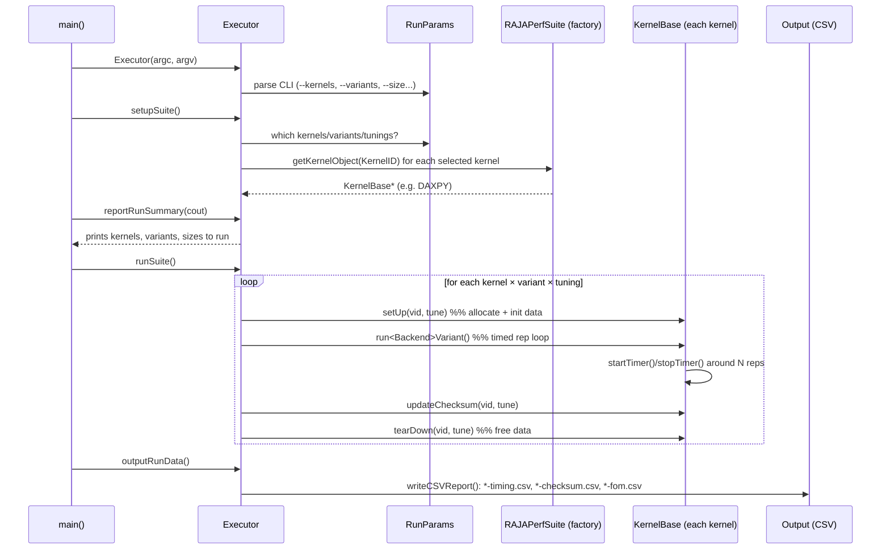

# RAJAPerf — Execution Flow

How a single `./raja-perf.exe` invocation runs, from `main()` to CSV output.

## The 5 steps in `main()` (`src/RAJAPerfSuiteDriver.cpp`)
```cpp
Executor executor(argc, argv);   // STEP 1: construct + parse CLI
executor.setupSuite();           // STEP 2: pick kernels & variants
executor.reportRunSummary(cout); // STEP 3: print plan (catch mistakes early)
executor.runSuite();             // STEP 4: run everything, collect timings
executor.outputRunData();        // STEP 5: write CSV / Caliper reports
```
(Plus optional MPI_Init/Finalize and Kokkos::initialize/finalize wrappers.)

## Sequence diagram


## What "runKernel" actually does (`Executor::runKernel`)
For every selected kernel, for every variant, for every tuning:
1. **setUp(vid, tune_idx)** — allocate and initialize input/output arrays on the
   correct memory space for the backend (host, CUDA/HIP device, etc.).
2. **run\<Backend\>Variant(vid)** — the timed section. Inside, a `switch(vid)`
   selects Base / Lambda / RAJA code. The rep loop is wrapped by
   `startTimer()` / `stopTimer()`.
3. **updateChecksum(vid, tune_idx)** — reduce the output into a checksum used to
   confirm every variant computes the same result.
4. **tearDown(vid, tune_idx)** — free the allocated data.

Timing is repeated over `npasses` and averaged; derived metrics (bandwidth,
FLOP rate) come from per-kernel `setBytes*PerRep()` / `setFLOPsPerRep()` values.

## Where the numbers in your CSV come from
| CSV column | Source |
|------------|--------|
| Problem size | `getActualProblemSize()` (set per kernel, scaled by `--size`) |
| Mean time per rep | measured wall time / reps, averaged over passes |
| Mean Bandwidth (GiB/s) | `bytesPerRep / time` — bytes declared in each kernel's `setSize()` |
| Mean flops (GFLOP/s) | `FLOPsPerRep / time` — FLOPs declared in each kernel's `setSize()` |
| Checksum / PASSED | `updateChecksum()` compared across variants |
